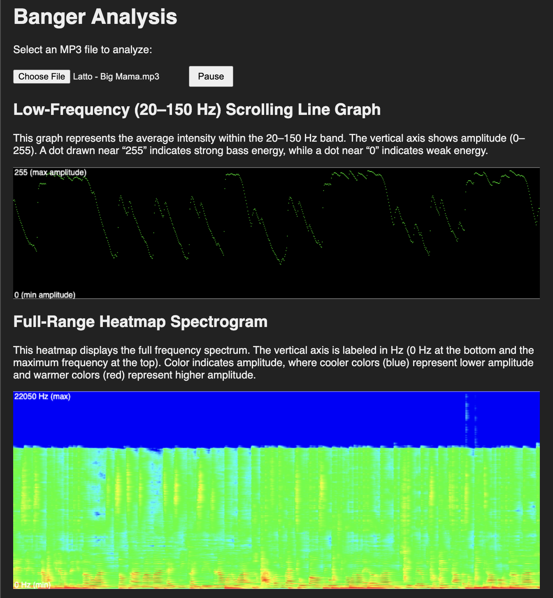

# Music Analysis: Tools for finding bangers.

I love dance music, especially the stuff that makes me _feel_. Like I want to feel the subwoofers thump in my chest. But outside of the club or inside my car, it's hard to tell what is going to give me that **oomph**. I don't have the budget for the fancy equipment at home, and I don't think my neighbors would love it either. How can I find what's going to sound good on subwoofers without running to my car?

The frequency range for sound that's coming through subwoofers is widely argued, but for my purposes I chose the range 20 - 150 Hz. Sound energy in this range would indicate I'd _feel_ it when I play it with subwoofers. 

## Visualizing a Banger



For a quick visual, I made [a client-side web app](https://nrrb.github.io/musicanalysis/) that uses the [createAnalyser()](https://developer.mozilla.org/en-US/docs/Web/API/BaseAudioContext/createAnalyser) method from the `BaseAudioContext` audio interface available in virtually all modern browsers, and displays a line graph of the average energy in the 20 - 150 Hz range along with spectrogram of the entire audio signal. Upload an MP3 and it will play the song while showing the energy analysis. See the code here: [index.html](./index.html)

## Library Analysis

Now I wanted to get a single numerical score per song for each of the songs in my library so I could compare them. A higher value would mean more energy in the 20 - 150 Hz range, which meant more _feeling_. 

For this task I made [a Python script](./batch_subsonic_energy.py) that would take as arguments the path to my music library and the path to an output CSV file:

Syntax:
```bash
python batch_subsonic_energy.py </path/to/music/> --output <energies.csv>
```

This shows a progress bar using [tqdm](https://tqdm.github.io/), since I observed that it took approximately 2 seconds per song and my collection of almost 1200 songs took about 40 minutes. 

Check out the full output I generated for my music library here: [energies.csv](./energies.csv)

Through my analysis, I found that the track in my collection with the greatest subs energy was an absolute banger of Jersey Club: [Mvntana - Werk (feat. Pyt Ny) [Clout Chaser 1 Extended]](https://soundcloud.com/teammvntana/werk-feat-nyema)

**Note**:
Because of excessive memory usage I observed when I just looped through all file analysis within the single script, I made it instead call itself with `python batch_subsonic_energy.py --process-file </path/to/music/song.mp3>`, which would then output to `STDOUT` the comma-separated values of `song_path`, `energy`, `song_duration`. The parent script instance would collect all output from the subprocesses and collate them into the output CSV. This way, the garbage collection on each process would happen automatically by the OS and deal with any possible memory leaks in [scipy](https://scipy.org/) or [librosa](https://librosa.org/doc/latest/index.html), which are what I used for the audio analysis. 

## Setup

Create a Python virtual environment and activate it. On macOS, I do this with:

```bash
python3 -m venv venv && source venv/bin/activate
```

Then install requirements:

```bash
pip install -r requirements.txt
```

## Credit

Nicholas Bennett
[LinkedIn](https://www.linkedin.com/in/nicholasrrbennett) | [Github](https://github.com/nrrb) | [website](https://nicholasbennett.work/)